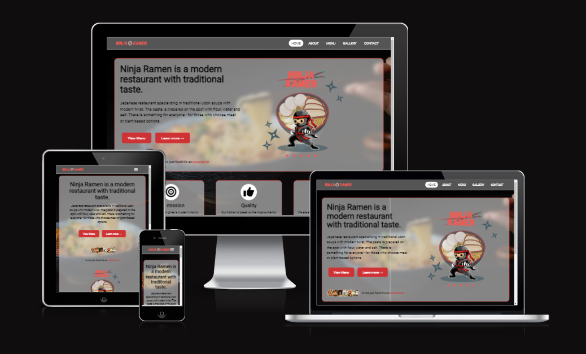
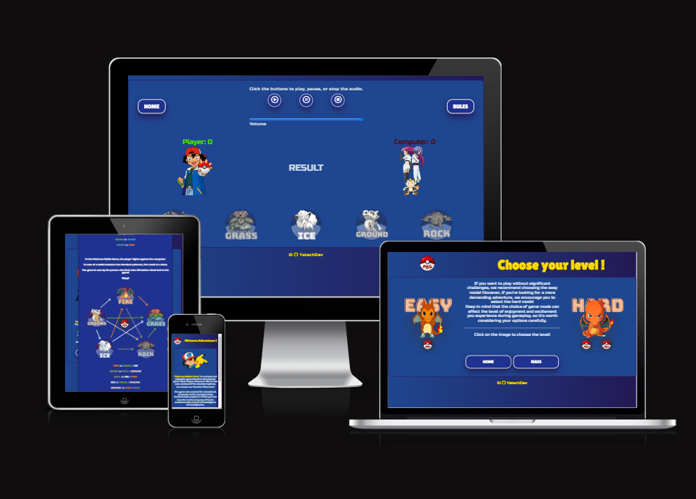

# Mateusz Smalarz - YatechDev

<!--
**YatechDev/YatechDev** is a ✨ _special_ ✨ repository because its `README.md` (this file) appears on your GitHub profile.

Here are some ideas to get you started:

- 🔭 I’m currently working on ...
- 🌱 I’m currently learning ...
- 👯 I’m looking to collaborate on ...
- 🤔 I’m looking for help with ...
- 💬 Ask me about ...
- 📫 How to reach me: ...
- 😄 Pronouns: ...
- ⚡ Fun fact: ...
-->
## About Me:

## My Stack:

#### Programming Language:

#### Frameworks:

#### My IDE:

#### Currently learning

## My Portfolio

### Portfolio Projects for [Code Institute](https://codeinstitute.net/) Diploma:

| No. |                                                                                                                    Project                                                                                                                     |                                                                                                                                                                                                                                                             Description                                                                                                                                                                                                                                                              |         Stack          | 
|:---:|:----------------------------------------------------------------------------------------------------------------------------------------------------------------------------------------------------------------------------------------------:|:------------------------------------------------------------------------------------------------------------------------------------------------------------------------------------------------------------------------------------------------------------------------------------------------------------------------------------------------------------------------------------------------------------------------------------------------------------------------------------------------------------------------------------:|:----------------------:|
|  1  |             

[Ninja Ramen](https://github.com/YatechDev/CI_PP1_Ninja_Ramen)
             |                                                                                                                                                   
The project goal is to create a website for a imaginary restaurant specializing in Japanese cuisine, which will be simple, pleasant to use, responsive for mobile phone users and compatible with all popular browsers. 
                                                                                                                                                    |       HTML & CSS       |
|  2  | 

[Pokemon Battle Game](https://github.com/YatechDev/CI_PP2_Pokemon_Battle_Game)
 |                                                                           
The aim of this project is to create an interactive game based on the classic "Rock, Paper, Scissors" game, set in the world of Pokémon. The game will have uncomplicated rules and two levels of difficulty to allow for both relaxing gameplay and challenges for more advanced players. The game interface will be easy to use, intuitive, and provide fast gameplay.
                                                                            | HTML, CSS & JavaScript |
|  3  |                                                    Python Essentials                                                                                                            30/05/2023                                                     |                                                                                                                                                                                                                                                                  -                                                                                                                                                                                                                                                                   |           -            |
|  4  |                                                                              Full Stack Toolkit                                                       11/09/2023                                                                               |                                                                                                                                                                                                                                                                  -                                                                                                                                                                                                                                                                   |           -            |
|  5  |                                                                                    E-Commerce                                                    20/11/2023                                                                                    |                                                                                                                                                                                                                                                                  -                                                                                                                                                                                                                                                                   |           -            |

[//]: # (### Elements Created by me:)

## Stats

