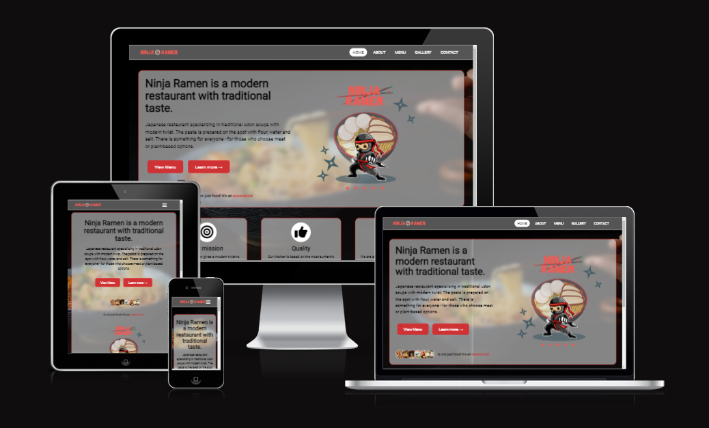

### Hi there 👋

<!--
**YatechDev/YatechDev** is a ✨ _special_ ✨ repository because its `README.md` (this file) appears on your GitHub profile.

Here are some ideas to get you started:

- 🔭 I’m currently working on ...
- 🌱 I’m currently learning ...
- 👯 I’m looking to collaborate on ...
- 🤔 I’m looking for help with ...
- 💬 Ask me about ...
- 📫 How to reach me: ...
- 😄 Pronouns: ...
- ⚡ Fun fact: ...
-->

### Portfolio Projects for [Code Institute](https://codeinstitute.net/) Diploma:

| No. |                                                                                              Project                                                                                               |                                                                                                           Description                                                                                                           |  Grade  | 
|:---:|:--------------------------------------------------------------------------------------------------------------------------------------------------------------------------------------------------:|:-------------------------------------------------------------------------------------------------------------------------------------------------------------------------------------------------------------------------------:|:-------:|
|  1  | 

[Ninja Ramen](https://github.com/YatechDev/CI_PP1_Ninja_Ramen)
 | 
The project goal is to create a website for a imaginary restaurant specializing in Japanese cuisine, which will be simple, pleasant to use, responsive for mobile phone users and compatible with all popular browsers. 
 | Waiting |
|  2  |                                                                                     2022-09-09   (In progress)                                                                                     |                                                                                                                -                                                                                                                |    -    |
|  3  |                                                                                             2022-10-17                                                                                             |                                                                                                                -                                                                                                                |    -    |
|  4  |                                                                                             2023-02-28                                                                                             |                                                                                                                -                                                                                                                |    -    |
|  5  |                                                                                             2023-05-30                                                                                             |                                                                                                                -                                                                                                                |    -    |

## Stats

